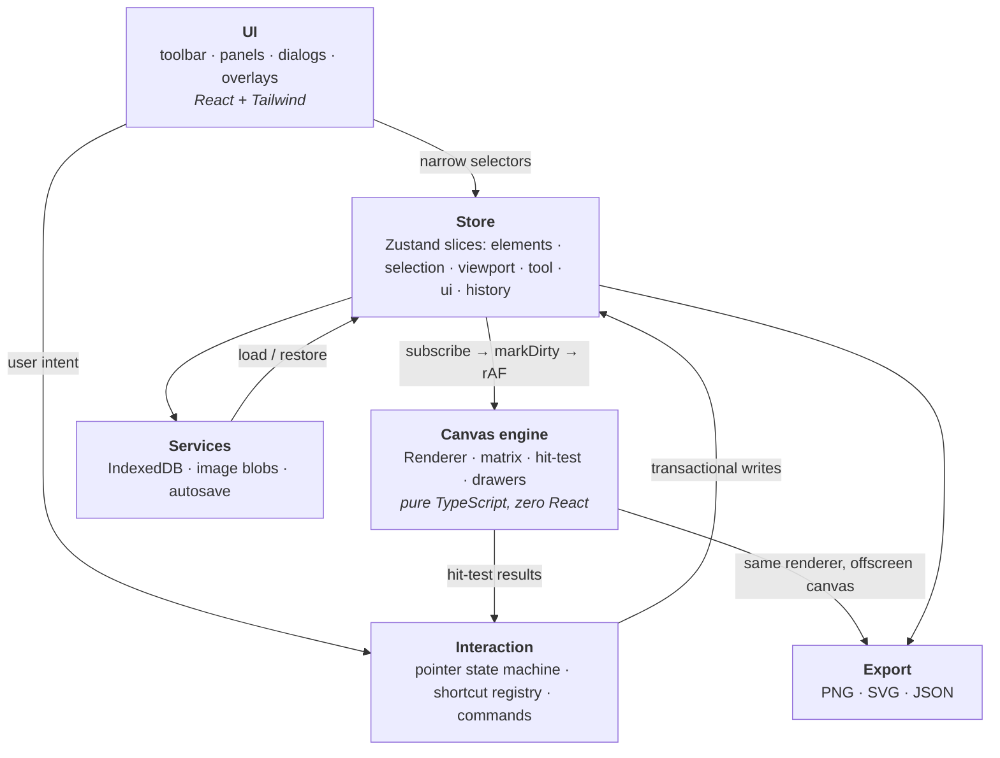

# CanvasForge

An infinite-canvas design editor for the browser, built on a **hand-rolled Canvas
2D rendering engine** - no Konva, no Fabric, no scene-graph library. Draw shapes,
arrange them, undo anything, and export to PNG, SVG, or JSON. Everything runs and
persists locally; there is no backend and no account.

**Live demo:** _`<deployment URL>`_ &nbsp;·&nbsp; **Docs:** [`docs/`](docs/)

The interesting parts are the ones a library would normally own: the affine
transform stack, hit-testing rotated shapes, the pointer state machine,
snapshot-based undo with structural sharing, and keeping a 60fps drag out of
React's render path. Each is written up in `docs/` with the trade-offs it cost.

---

## Running it

Requires Node 20+.

```bash
npm install
npm run dev        # Vite dev server
npm run test       # vitest run  - 654 tests
npm run build      # tsc -b && vite build
npm run preview    # serve the production build
```

`npm run verify` runs the full gate: `typecheck && lint && test && build`.

---

## Features

Everything listed here is implemented and reachable in the running app.

**Canvas**

- Infinite pan and zoom (2%–6400%), zoom held about the cursor
- Pan by space-drag, middle-drag, the hand tool, or two-axis wheel/trackpad scroll
- Zoom by Ctrl/⌘+wheel or trackpad pinch, discrete `+`/`−` steps, zoom-to-fit, zoom-to-100%
- Dot grid drawn in world space; hidden below 35% zoom where it would be noise
- Device-pixel-ratio aware, and it re-adapts when a window moves between monitors

**Drawing**

- Rectangle (with corner radius), ellipse, line, arrow (with per-end arrowheads),
  freehand, text, image
- Per-tool style memory - the fill you chose for rectangles doesn't repaint your arrows
- Click-to-place produces a default-sized shape instead of a speck

**Text and images**

- Edit text in place: a `<textarea>` overlay positioned in screen space over the
  element, tracking pan and zoom, typeset in world units so the browser wraps
  against exactly the numbers the renderer will
- Full typography - family, size, weight, italic, alignment, line height, colour
- Images by drag-and-drop, paste, the image tool, or a keyboard-reachable picker
- Uploads are downscaled to 2400px on the long edge and stored as blobs keyed by
  content hash, so the same photo dropped ten times is stored and decoded once

**Selection and transform**

- Click, shift-click to toggle, marquee drag, select-all
- Move by drag or arrow-key nudge (Shift for 10× steps)
- Resize from 8 handles, with aspect lock (Shift, or an editor-wide toggle in
  the properties panel that persists across selections) and resize-from-centre
  (Alt)
- Rotate with a 15° snap while Shift is held
- A single rotated element resizes along **its own** axes, not the screen's
- Handles stay 8 screen pixels at every zoom

**Grouping**

- Group and ungroup (⌘/Ctrl+G, ⌘/Ctrl+⇧+G), nested to any depth
- A group moves, resizes and rotates as one unit - and a style edit on a group
  applies to every shape inside it
- Clicking any member selects the whole group; double-click descends into it,
  Escape steps back out
- Lock and hide are inherited: a member of a locked group can't be dragged, a
  member of a hidden group isn't drawn or clicked
- Align and distribute count a group as one item, not as its contents
- Groups export as real, nested SVG `<g>` elements and as nested JSON

**Panels**

- **Properties** - position, size, rotation, fill, stroke, stroke width and style,
  corner radius, opacity, and full typography for text. Multi-selection shows
  `Mixed` for values that disagree, and hides controls no selected element supports.
  Number fields drag-to-scrub.
- **Layers** - the document as a real keyboard-navigable tree. Expand and collapse
  groups, reorder by drag - including into and out of a group, via a three-zone
  drop target - rename, hide, lock.
- **Arrange** - align (6 edges), distribute (2 axes), and z-order (front / forward /
  backward / back)
- **Minimap** - a document overview with click-and-drag navigation, floating over
  the canvas on desktop widths

**Editing**

- Undo/redo with named steps ("Undo Move 3 elements"), 100 deep
- A continuous drag, a scrub, and a held arrow key are each **one** undo entry
- Escape aborts an in-flight gesture and rolls it back
- Cut / copy / paste / duplicate, including paste between two CanvasForge tabs

**Persistence and export**

- Autosave to IndexedDB, debounced and blocked while a gesture is in progress
- Multiple projects: create, open, duplicate, rename, delete
- Export PNG (1×/2×/3×, optional transparency), SVG, or JSON; import JSON back
- Schema-versioned project files with a forward-only migration chain
- Corrupt input degrades per element rather than failing the load

**Interface**

- Command palette (⌘/Ctrl+K) over a single command table shared with the toolbar
  and the keyboard, so a shortcut and its palette entry cannot disagree
- Light and dark themes, applied before first paint (no flash)
- Responsive layout: below `lg` the panel rail becomes an overlay sheet rather
  than squeezing the canvas into a strip
- A demo document on first run, so the app opens showing what it does

---

## Tech stack

|                                        |             | Why                                                                                                                                                                                                                                           |
| -------------------------------------- | ----------- | --------------------------------------------------------------------------------------------------------------------------------------------------------------------------------------------------------------------------------------------- |
| **React 19** + **TypeScript** (strict) | UI shell    | Strict mode with `noUncheckedIndexedAccess`; no `any` in the codebase                                                                                                                                                                         |
| **Vite 8**                             | build       | Fast HMR; the production build is `tsc -b && vite build`, so a type error fails the build                                                                                                                                                     |
| **Zustand 5**                          | state       | Selector-based subscriptions, and - critically - usable _outside_ React via `getState`/`subscribe`. Context re-renders every consumer on any change, which is fatal at pointer frequency. ([ADR 002](docs/decisions/002-state-management.md)) |
| **Canvas 2D**, hand-written            | rendering   | The parts a scene-graph library owns are exactly the parts worth being able to explain. ~1,700 lines including its (extensive) comments, and it makes offscreen export nearly free. ([ADR 001](docs/decisions/001-rendering-engine.md))       |
| **IndexedDB**, hand-written wrapper    | persistence | localStorage is ~5MB, string-only, and synchronous - a base64 image is a countdown. 324 lines (about 210 of code), behind an injectable interface. ([ADR 004](docs/decisions/004-persistence.md))                                             |
| **Tailwind 4**                         | styling     | Layout and spacing only; the theme is CSS custom properties, so light/dark is one token swap                                                                                                                                                  |
| **Vitest** + **Testing Library**       | tests       | jsdom, 654 tests, zero test-only fakes beyond the runner                                                                                                                                                                                      |

Runtime dependencies in total: React, React DOM, React Router, Zustand,
`lucide-react`, `clsx`, and one font. No canvas library, no state-management
middleware, no schema-validation library, no IndexedDB wrapper.

---

## Architecture

Five layers, dependencies pointing downward only. The engine imports no React and
no store; the store imports no components.



The two expensive things in a canvas editor are React re-renders and redraws.
Splitting the engine out of React means a 60fps drag touches **zero** React
components: the store notifies the renderer directly and the renderer paints.
React only re-renders when a number a human is reading actually changes.

Full walkthrough: [`docs/architecture.md`](docs/architecture.md).

---

## The parts worth reading

### Data model - [`docs/data-model.md`](docs/data-model.md)

Eight element types in one discriminated union, with an `assertNever` guard in
every `switch`, so adding a ninth is a **compile error** at four sites rather
than a runtime gap. The document is `{ byId, order }` - a map for O(1) lookup plus
an array of root-level z-order - and there is deliberately **no `zIndex` field**,
because an ordered array cannot represent a duplicate or a gap. Lines and arrows
carry a bounding box with normalized endpoints, so one transform implementation
serves every type. Images hold a content-hash key, never pixels. A group is the
eighth variant: it holds membership and **no transform of its own**, so a group
transform and a multi-selection transform are literally the same call
([ADR 006](docs/decisions/006-grouping.md)).

### Coordinate system - [`docs/coordinate-system.md`](docs/coordinate-system.md)

Screen space and world space, kept apart by **branded types** that make
`screenToWorld(worldPoint)` a compile error. All conversion lives in one file.
Zoom-about-cursor is derived algebraically (hold the anchor fixed, solve for pan)
and the clamp is applied _before_ the solve, so the invariant survives the zoom
limits. Device pixel ratio is deliberately kept out of the viewport transform -
folding it in leaks a factor of two into hit-testing that only reproduces on
retina displays.

Hit-testing inverts the element's matrix and moves the _point_ into local space,
where every shape is axis-aligned at the origin. Rotation therefore needs no
per-type special case at all.

### State - [`docs/state-management.md`](docs/state-management.md)

Six slices, one flat state object, one write path into history. Selection is a
`Set<ElementId>` in its own slice - a `selected` flag on the element would enter
history, dirty autosave, and get serialized. The canvas component renders once and
subscribes imperatively; `CanvasStage.test.tsx` proves it with a React `Profiler`
that counts commits and asserts three store writes produce zero React work.

### Undo/redo - [`docs/history.md`](docs/history.md)

Whole-document snapshots, made affordable by treating elements as immutable: one
moved rectangle in a 5,000-element document costs a new map of pointers plus one
element, not 5,000 clones. Explicit transactions turn a 200-event drag into one
entry, and the same three calls are reused by the properties panel's drag-to-scrub
and by held-key arrow nudging. Commit is a no-op when nothing changed; abort
restores the redo stack as well as the document.

Chosen over the command pattern because command/inverse needs a correct `undo()`
for every mutation type, and inverses drift out of sync in ways that are hard to
test. ([ADR 003](docs/decisions/003-history.md))

### Export - [`docs/export.md`](docs/export.md)

PNG reuses the **same renderer** against an offscreen canvas - a direct payoff of
keeping the engine React-free, and it means the export cannot drift from the
screen. SVG is a separate serializer, and the document is explicit about where it
is _not_ faithful. Two traps are documented in detail: images must be decoded
before an export renders (there is no next frame to fix a cache miss), and browser
canvas limits do not throw when exceeded - they silently produce a blank image, so
the scale is clamped up front and the clamp is reported to the user.
([ADR 005](docs/decisions/005-export.md))

### Performance - [`docs/performance.md`](docs/performance.md)

Architectural rather than tuned: canvas outside React, rAF coalescing (N store
writes → 1 paint), viewport culling against rotation-aware AABBs, normalized
element map, structural sharing in history, blob-keyed images, narrow selectors.
Deliberately _not_ done: memoizing every component, virtualizing the layers panel,
spatial indexing for hit-testing. Measured numbers live in that document.

### Testing - [`docs/testing.md`](docs/testing.md)

654 tests weighted toward logic that is easy to get subtly wrong: coordinate round
trips, matrix inversion, rotated hit tests, the interaction state machine (54
tests over a pure reducer), history transactions, migrations, export planning.

Browser-only code is reached through injectable seams - `StorageBackend`,
`ImageCodec`, and the PNG canvas/paint/encode trio - which is how IndexedDB and
canvas logic are tested under jsdom with **zero** test-only fakes. The in-memory
storage backend is not a mock: it is the production fallback for when IndexedDB is
unavailable, so that path is exercised by the suite rather than first running in
front of a user.

The document is also honest about the limit: every one of those tests passed while
the properties panel was clipping "100%" to "10". See
[`docs/problems-log.md`](docs/problems-log.md) entry 002.

---

## Trade-offs

Stated because they are real, not to pre-empt criticism.

- **Canvas is opaque to screen readers.** Inherent to the choice. Mitigated
  architecturally: the layers panel is a real keyboard-navigable list that is the
  document's accessible counterpart, every canvas operation has a DOM equivalent,
  and the canvas carries a description pointing at it. It is not the same as
  accessible content.
- **SVG export is not pixel-identical.** Thick-stroked arrowheads are sized by a
  different rule, and text vertical placement uses a different convention. Every
  known divergence is enumerated in `docs/export.md` rather than discovered later.
- **Undo memory scales with document size × depth.** Capped at 100 entries. A
  freehand path with thousands of points, edited repeatedly, is the realistic worst
  case; a HAMT or a patch log is the answer at a scale nothing has measured yet.
- **Undo does not restore selection.** Selection is excluded from snapshots on
  purpose, so undoing a delete brings the element back unselected.
- **Selector discipline is a convention, not a constraint.** One
  `useCanvasStore(s => s.elements)` in a panel would re-render it every frame of a
  drag. Mitigated by 20 pre-narrowed hooks and one test on the path that matters
  most; not enforced by a lint rule.
- **Hit-testing is a linear scan** over culled elements. Fast enough at target
  scale; a quadtree needs incremental maintenance on every move and nothing
  measured justifies it yet.
- **Browser storage is not durable.** Clearing site data destroys everything, and
  browsers may evict under pressure. This is the cost of "no account required".
  JSON export is the user-controlled backup.
- **Very large documents are still bounded by the canvas, not the panels.** The
  layers panel is windowed (45,231 DOM nodes became 538 at 2,000 elements), but
  frame cost still tracks how many elements are *visible*: with 2,000 on screen
  at once a frame is ~14ms. See [performance](docs/performance.md).
- **Single document at a time.** The store is a module singleton, so two editors
  cannot coexist on one page.
- **Resizing a rotated group shears slightly.** Groups bake their transform into
  their members, so descendants scale in the group's axis-aligned frame. Figma
  has the same limitation; the alternative is a full nested-transform scene
  graph ([ADR 006](docs/decisions/006-grouping.md)).
- **A group transform from the properties panel is one gesture at a time.**
  Position, size and angle all write to the group's _members_, because its box
  is a derived cache - the same redirection the canvas makes for a frame drag.
  Each gesture is defined against the state it started from - the leaves, the
  frame, and the aspect lock's ratio - so a scrub and a typed value land in the
  same place whatever the frame rate; but across two gestures the frame and the
  pivot are re-measured, so 45° twice and 90° once differ, for the handle and
  the field alike ([ADR 006](docs/decisions/006-grouping.md)).
- **Reparenting is pointer-only.** Alt+Arrow reorders within the root order and
  refuses a nested row, so moving a layer into or out of a group needs a drag in
  the layers panel. A real accessibility gap in the panel that is otherwise the
  canvas's keyboard-navigable counterpart.
- **Grouping costs write throughput.** Every store write re-derives group boxes;
  a group-free document pays nothing measurable, and 4,000 elements in a single
  group costs ~15ms/frame against ~5.4 flat. See
  [performance](docs/performance.md) §7c.

---

## Not built

Explicitly out of scope, listed so the boundary is visible rather than implied:

- **Real-time multiplayer.** Would mean replacing the history layer, not extending
  it - CRDT/OT needs operations that transform against each other, and snapshots
  have discarded exactly that information.
- **Cloud persistence and accounts.** Local-first is a product position here, not a
  limitation being spun.
- **Comments and annotations**, **version history** beyond the undo stack,
  **reusable components/symbols**.
- **Advanced vector tools** - boolean operations, bézier pen, path editing, masks.
- **Dragging elements into or out of a group on the canvas.** Reparenting is via
  Ctrl+G, Ctrl+Shift+G, and drag in the layers panel. Canvas drag-to-reparent
  needs drop-target detection and a live preview, and reads as broken at 90%
  complete.
- **Groups with an independent transform** (Figma *frames* rather than Figma
  *groups*), which is the nested-transform scene graph ADR 006 rejects.
- **PDF export**, clipboard image copy, worker-offloaded export.
- **Screenshot-diff visual regression tests** and a real-browser smoke pass.

---

## Repository layout

```
src/
├── app/          shell, routes (landing / editor), error boundaries
├── components/   canvas · toolbar · panels · dialogs · common primitives
├── features/
│   ├── canvas/engine/       Renderer, matrix, hitTest, drawers - pure, no React
│   ├── canvas/interaction/  pointer state machine, protocol, intent executor
│   ├── selection/ elements/ alignment/ history/ properties/
│   ├── export/    PNG · SVG · JSON serializers
│   ├── project/   serialize, validate, migrations, session
│   ├── commands/  command table, clipboard
│   └── shortcuts/ chord normalization, registry
├── store/        six Zustand slices
├── services/     IndexedDB, image blob store, project repository, autosave
├── utils/        coords, geometry, id
├── types/        element union, project schema, branded geometry
└── constants/    zoom limits, handle sizes, defaults, storage keys

docs/             architecture, per-topic deep dives, ADRs, problems log
```
