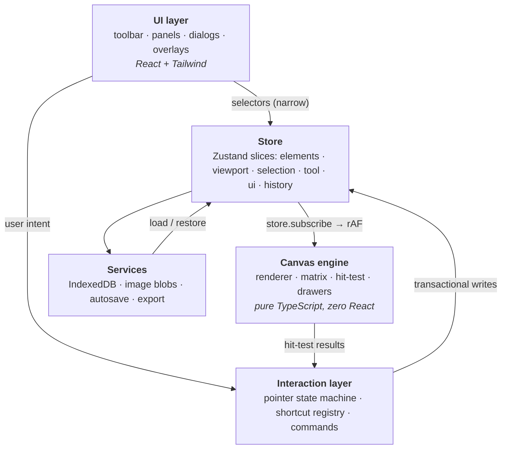

# CanvasForge - Architecture

Status: **living document**. Written alongside the implementation, updated when the implementation changes. If this file disagrees with the code, the code is right and this file is a bug.

---

## 1. Shape of the system

Five layers. Dependencies point **downward only** - the engine never imports React, the store never imports components.



Why layered this way: the two expensive things in a canvas editor are **React re-renders** and **redraws**. Splitting the engine out of React means a 60fps drag touches zero React components - the store notifies the renderer directly and the renderer paints. React only re-renders when something a _panel_ displays actually changes.

### Module boundary rules

| Layer                     | May import                                                  | Must never import           |
| ------------------------- | ----------------------------------------------------------- | --------------------------- |
| `features/canvas/engine`  | `types`, `utils`, `constants`, other _pure_ feature modules | React, store, components    |
| `features/*` (non-engine) | `types`, `utils`, `store`, `constants`                      | components                  |
| `store`                   | `types`, `utils`, `features/history`, `constants`           | React components, engine    |
| `components`              | everything below                                            | other components' internals |

The engine's licence to import "other pure feature modules" is narrow and load-bearing: the overlay pass needs selection bounds and handle geometry, which live in `features/selection/` because the interaction layer needs the same maths. Duplicating them so the engine could stay leaf-level would put the definition of "where is the north-west handle" in two places, and the two would drift. The rule that actually matters is unchanged - the engine touches no React and no store - so the constraint is stated as purity rather than as directory position.

The engine being React-free is also what makes PNG export trivial: render the same scene into an offscreen canvas with a different viewport transform.

---

## 2. Data model

### Project

```ts
interface ElementStore {
  byId: Readonly<Record<ElementId, CanvasElement>>; // normalized
  order: readonly ElementId[]; // ROOT-level z-order. Bottom → top.
}

interface Project {
  id: string;
  name: string;
  viewport: Viewport; // restored on open so the user returns to where they were
  elements: ElementStore;
  metadata: { createdAt: string; updatedAt: string };
}
```

`schemaVersion` is deliberately **not** on `Project`. It describes the encoding, not the document, so it lives on `SerializedProject` - the shape that crosses the storage and export boundary (§7). An in-memory document carrying a version number would invite code to branch on it long after the migration chain had already normalized everything.

**Why normalized map + separate order array**, rather than a plain array of elements:

- Lookup by id during hit-testing and selection is O(1), not O(n).
- Reordering a layer mutates a small array of strings, not the element records - cheap, and it keeps every element object reference stable, which is what makes history structural sharing work (§6).
- Selection stores ids; with a map they resolve in constant time.

The cost is that "give me elements in paint order" is a walk over `order`. That's one pass per frame and it's memoized against the `ElementStore`'s identity.

**`order` holds root-level ids only, and paint order is a depth-first walk.** A group's members live on its `childIds`, so the document is a forest and `order` is its roots. A walk over the tree belongs in `features/elements/tree.ts` unless there is a stated reason it can't: `elementsInPaintOrder` answers "what is in the document", `elementsToPaint` answers "what the engine needs to see" (a flat array with each ancestor's opacity folded in and effectively-hidden subtrees dropped, because `RenderScene.elements` is flat by contract and the renderer holds no store handle), and `leavesOf` answers "which elements hold real geometry" for the transform path. Four call sites hand-write their own guarded recursion instead, each with its own reason: `serialize.ts`'s writer, `svg.ts`'s `groupChildrenMarkup`, `layerRows.ts`'s `buildLayerRows`, and `projectRepository.ts`'s `walkForest` (see `docs/decisions/006-grouping.md`).

Every one of those walks carries a shared `visited` set, and that is correctness rather than defensiveness: `childIds` is data that survives a round trip through a project file, so a group listing itself is a document that can exist. In `walkChildren` the set is also the mechanism that makes "emit each id once" true for a selection naming both a group and one of its members.

This narrowing is the single riskiest change in §2's history: the type did not change, so nothing failed to compile, and twelve production call sites of `elementsInOrder` silently stopped seeing group members. See `docs/problems-log.md` entry 006.

### Elements

A discriminated union on `type`. Common base:

```ts
interface BaseElement {
  id: ElementId;
  type: ElementType;
  name: string; // shown in the layers panel, user-renameable
  x: number;
  y: number; // world coords of the element's top-left, pre-rotation
  width: number;
  height: number;
  rotation: number; // radians, about the element's centre
  opacity: number; // 0..1
  locked: boolean;
  visible: boolean;
}
```

Variants: `RectangleElement` (adds `cornerRadius`, fill, stroke), `EllipseElement`, `LineElement` and `ArrowElement` (add explicit endpoints + arrowhead style), `TextElement` (font family/size/weight/style, align, lineHeight, color, content), `ImageElement` (references a blob by key - see §8), `FreehandElement` (points array + stroke), `GroupElement` (a `childIds` membership list and nothing else).

`GroupElement` is the one variant that draws nothing and owns no geometry: it has no transform of its own, and its `x`/`y`/`width`/`height` are a derived cache of the union of its leaf descendants, re-derived on the store's single write path (`store/deriveGroups.ts`). `rotation` is 0. The consequence to know before touching the transform path is that a patch naming a group's own box is recomputed away inside the same synchronous write - the leaves are what move. Full argument: [ADR 006](decisions/006-grouping.md); model detail: `docs/data-model.md` §2.

`zIndex` from the spec is **deliberately not a field** - depth is the index in `elementOrder`. A per-element `zIndex` number invites duplicates, gaps, and renumbering bugs; an ordered array cannot represent an invalid state.

Every `switch` on `element.type` ends with a `default: assertNever(element)` so adding a variant is a compile error at every site that must handle it.

### Why lines and arrows still carry `x/y/width/height`

They need a bounding box for selection, marquee tests, and alignment. The endpoints are stored as normalized offsets within that box, so a line resizes and rotates through exactly the same transform code as a rectangle. One transform implementation, not two.

---

## 3. Coordinate system

Two spaces, kept rigidly separate. Mixing them is the single most common bug class in canvas editors, so the types enforce the split.

```
Screen space                    World space
(CSS pixels, origin = canvas    (document units, origin = arbitrary,
 top-left, y down)               unbounded in every direction)

    pointer events                   element.x / element.y
          │                                   ▲
          │  screenToWorld                    │
          ▼                                   │  worldToScreen
    ┌─────────────────────────────────────────┴──┐
    │            Viewport transform              │
    │   { panX, panY, zoom }                     │
    └────────────────────────────────────────────┘
```

```ts
type Viewport = { panX: number; panY: number; zoom: number };

// world → screen
screenX = worldX * zoom + panX;
screenY = worldY * zoom + panY;

// screen → world  (the algebraic inverse)
worldX = (screenX - panX) / zoom;
worldY = (screenY - panY) / zoom;
```

`ScreenPoint` and `WorldPoint` are **branded types** - structurally identical at runtime, distinct to the compiler. Passing a screen point to a function expecting world coords fails to compile. The only place the brands are added or stripped is `utils/coords.ts`.

The canvas is "infinite" in the sense that nothing clamps `panX`/`panY` and no document bounds exist. Zoom is clamped to `[MIN_ZOOM, MAX_ZOOM]` because below ~1% pixels vanish and above ~64× float precision in the transform starts to visibly wobble.

### Zoom about the cursor

Naïve zoom multiplies `zoom` and leaves pan alone, which zooms about the canvas origin and feels wrong. The fix: hold the world point under the cursor fixed across the change.

```
1. anchorWorld = screenToWorld(cursorScreen, viewportBefore)
2. zoomNext    = clamp(zoom * factor, MIN_ZOOM, MAX_ZOOM)
3. solve for pan such that worldToScreen(anchorWorld, viewportAfter) === cursorScreen
      panX = cursorScreen.x - anchorWorld.x * zoomNext
      panY = cursorScreen.y - anchorWorld.y * zoomNext
```

The same routine backs "zoom to fit" (anchor = content bounds centre, zoom = the fit ratio with padding), the toolbar's +/− buttons (anchor = viewport centre), and trackpad pinch - which arrives as a `ctrlKey` wheel event carrying its own coordinates, so it is the cursor case rather than a separate one. True multi-touch pinch, which would anchor on the midpoint between two `pointerdown`s, is **not** implemented; touch input currently pans and taps but does not pinch.

### Device pixel ratio

The backing store is sized `cssSize * devicePixelRatio` and the context is scaled by DPR once per resize, so all drawing code works in CSS pixels and text stays sharp on retina displays. DPR is _not_ folded into the viewport transform - keeping it in the canvas setup means it never leaks into hit-testing, where it would be a silent factor-of-2 bug.

---

## 4. The rendering engine

Hand-written Canvas 2D. No scene-graph library.

**Why not Konva/Fabric** (full reasoning in `docs/decisions/001-rendering-engine.md`): the parts a scene-graph library owns - hit-testing, the transform stack, resize/rotate handles - are exactly the parts worth being able to explain. They are also, at this feature scope, a few hundred lines. The library would add bundle weight and a second reconciler (react-konva) whose re-render semantics need their own explanation, in exchange for hiding the interesting code.

### Frame loop

```
store change ──► markDirty() ──► rAF scheduled (coalesced) ──► render()
```

`markDirty` is idempotent within a frame: ten store writes between two frames produce one paint. Nothing calls `render()` synchronously from an event handler.

`render()` per frame:

1. Clear, apply DPR scale.
2. Apply the viewport transform once: `ctx.setTransform(zoom, 0, 0, zoom, panX, panY)`.
3. Draw the grid/dot background in world space so it pans and zooms with the content.
4. **Cull**: skip elements whose world AABB doesn't intersect the visible world rect, so frame cost tracks what is on screen rather than what exists. Measured on a 2,000-element document: 9.3% drawn at 100% zoom, 8.3ms/frame while panning. Note what this does and does not buy - the cull makes a _large document_ cheap, not a _dense screen_. Zoomed out so all 2,000 are visible, the frame is 14.3ms of main-thread work: still 60Hz, no longer 120Hz. Ten thousand simultaneously visible elements would not hold either.
5. For each visible element in `elementOrder`: `ctx.save()`, apply the element's local transform (translate to centre → rotate → translate back), dispatch to the drawer for its `type`, `ctx.restore()`.
6. Draw the overlay pass - selection box, resize/rotate handles, marquee, snap guides - **un-zoomed**, so handles stay a constant 8px on screen at every zoom level.

Drawers live in `engine/drawers/`, one small pure function per element type: `(ctx, element) => void`. Adding an element type = one drawer + one union member.

### Hit-testing

Point-in-rotated-shape is solved by moving the _point_ into the element's local space rather than transforming the shape:

```
localPoint = inverse(elementMatrix) · worldPoint
then test localPoint against the axis-aligned shape (trivial per type)
```

`engine/matrix.ts` provides compose / invert / apply for 2D affine matrices as flat `[a,b,c,d,e,f]` tuples. Elements are picked top-down through `elementOrder` reversed, first hit wins, skipping hidden and locked elements. Strokes get a tolerance band scaled by `1/zoom` so a 1px line is still clickable when zoomed out.

Marquee selection tests world-AABB intersection, not per-pixel - fast and matches user expectation.

---

## 5. State management

Zustand, one store, composed from slices. Chosen over Redux for the boilerplate-to-value ratio at this size, and over Context because Context re-renders every consumer on any change - fatal for a store that updates during drags. (`docs/decisions/002-state-management.md`.)

| Slice       | Holds                                              | Notes                                         |
| ----------- | -------------------------------------------------- | --------------------------------------------- |
| `elements`  | `Record<id, CanvasElement>`, `elementOrder`        | The document. All mutations transactional.    |
| `viewport`  | `panX`, `panY`, `zoom`                             | High-frequency. Not in history.               |
| `selection` | `Set<ElementId>`                                   | Separate from elements by design - see below. |
| `tool`      | active tool, per-tool default style                |                                               |
| `ui`        | theme, panel visibility, dialog state, save status | Persisted to localStorage, not IndexedDB.     |
| `history`   | past / future stacks, transaction depth            | §6.                                           |

**Why selection is its own slice.** Putting `selected: boolean` on the element means every selection change mutates the document, which means it enters history ("undo" would undo a click), dirties autosave, and gets serialized into the saved file. Selection is view state about the document, not part of it. Keeping it as a `Set` of ids also makes "select all", set operations for shift-click, and multi-select math direct.

**Why the viewport is in the store but not in history.** The renderer needs it, panels display the zoom %, and it's saved with the project so reopening restores your position - but nobody expects Ctrl+Z to undo a scroll.

### Re-render discipline

- The `<canvas>` component mounts once and renders `null` thereafter. It subscribes to the store in an effect and calls `markDirty`. Element changes therefore cost **zero** React work.
- Panels use narrow selectors (`useStore(s => s.selection.size)`) with shallow equality. A panel that subscribes to the whole elements map re-renders on every pointermove of a drag - treated as a bug.
- The properties panel reads only the selected elements, and numeric inputs are locally-controlled while focused so typing doesn't round-trip through the store per keystroke.

---

## 6. History

**Snapshot-based with structural sharing and explicit transactions.**

```ts
type HistoryEntry = {
  elements: Record<ElementId, CanvasElement>;
  elementOrder: ElementId[];
  label: string; // "Move 3 elements" - surfaced in the UI
};
```

Undo/redo swaps whole document snapshots. That sounds expensive and isn't, because **elements are treated as immutable**: mutating one element produces a new map where every _other_ element is the same object reference. A 5,000-element document with one moved rectangle costs one new map (5,000 pointers, ~40KB) plus one new element object - not 5,000 clones.

### Transactions are what make dragging one undo step

```ts
beginTransaction('Move elements');   // pointerdown - snapshot taken here
  … many updateElement() calls …     // pointermove - mutate live state, history untouched
commitTransaction();                 // pointerup - snapshot pushed as ONE entry
```

`updateElement` outside a transaction opens and commits an implicit one, so single actions (a colour change, a delete) are still atomic. `abortTransaction()` restores the opening snapshot - that's how Escape cancels an in-flight drag.

Nested `begin` calls increment a depth counter and only the outermost commit pushes, so composite operations ("align 5 elements", which internally moves each) are one entry.

**Chosen over the command pattern** because command/inverse-command needs a correct `undo()` for every mutation type - every new element property is a new inverse to write and get right - and inverses drift out of sync with forward operations in exactly the ways that are hard to test. Snapshots have one code path, so the class of bug doesn't exist. (`docs/decisions/003-history.md`.)

**Limitations, stated honestly:** memory scales with document size × history depth, so the stack is capped at `HISTORY_LIMIT` entries and the oldest are dropped. Freehand elements with thousands of points and image elements are the memory risk; images help themselves by storing a blob key rather than the pixels (§8). At a scale where this stopped working the answer is a persistent immutable structure (HAMT) or a patch log - noted as future work, not built, because at the target scale it would be complexity without a measured payoff.

Redo is cleared on any new mutation. The viewport, selection, and UI slices are excluded from snapshots.

---

## 7. Persistence and versioning

- **IndexedDB** - projects and image blobs. Chosen over localStorage because localStorage is ~5MB, string-only (a base64 image is +33% overhead), and synchronous on the main thread. IndexedDB stores `Blob`s natively and is async. (`docs/decisions/004-persistence.md`.)
- **localStorage** - theme, panel layout, last-opened project id. Small, synchronous-read-at-boot is actually a feature here: no theme flash.

**Autosave** is debounced (~800ms after the last change) and skipped while a transaction is open, so nothing writes mid-drag. Save status is a three-state machine surfaced in the toolbar: `saved · saving · unsaved`, plus `error` when a write fails so a full disk or private-mode quota block is visible rather than silent.

**Schema versioning.** Every serialized project carries `schemaVersion`. On load, a migration chain runs it forward:

```
migrations: Record<number, (doc: unknown) => unknown>
loaded.schemaVersion < CURRENT  → run each migration in sequence
loaded.schemaVersion > CURRENT  → refuse, tell the user the file is from a newer version
```

`CURRENT_SCHEMA_VERSION` is **2**. v2 nested `elements` from a flat array into a forest, groups carrying their members inline; the v1→v2 step is near-identity because a flat v1 array is already a valid forest of roots with no children, and it exists and is tested anyway because a gap in the chain is a hard error.

Loading is defensive throughout: the document is validated, and any element that fails validation is dropped with a warning rather than aborting the load. A corrupt file should cost you one shape, not the project. Nesting added one new hostile-input class - depth - capped at `MAX_GROUP_DEPTH` (64) upstream of every recursive walk over untrusted input.

---

## 8. Images

Uploaded images are stored as `Blob`s in IndexedDB under a content key. `ImageElement` holds the key, not the pixels. Consequences:

- The same image dropped ten times is stored once and decoded once.
- History snapshots carry a short string per image element, not megabytes of base64.
- An in-memory `Map<key, HTMLImageElement>` cache backs rendering; the renderer draws a placeholder while a decode is pending rather than blocking the frame.
- Oversized uploads are downscaled to a max dimension before storage - a 6000px photo on a 1200px canvas is wasted memory and a slow `drawImage` every frame.

JSON export inlines images as data URIs so an exported file is self-contained; that's a deliberate size-for-portability trade, and it's why the _storage_ format and the _export_ format are not the same format.

---

## 9. Export

| Format   | How                                                                                                                                                                                    | Limits                                                                                                                 |
| -------- | -------------------------------------------------------------------------------------------------------------------------------------------------------------------------------------- | ---------------------------------------------------------------------------------------------------------------------- |
| **PNG**  | Render the scene to an offscreen canvas with a viewport fitted to the content (or the selection) bounds, at a chosen scale factor. Same engine, different target - no second renderer. | Raster. Very large exports can exceed browser canvas dimension limits; the scale factor is clamped accordingly.        |
| **SVG**  | A separate serializer that maps each element type to SVG markup; a group becomes a real `<g>` mirroring the tree, with no `transform` attribute because transforms bake.                | Not pixel-identical to the canvas: freehand and some stroke effects are approximations. Documented rather than hidden. |
| **JSON** | The project document plus `schemaVersion`, images inlined, groups nested. Round-trips through import.                                                                                  | -                                                                                                                      |

That PNG export reuses the renderer is a direct payoff of keeping the engine React-free: it's a function from `(elements, viewport, canvas)` to pixels, and it doesn't care that the canvas isn't on screen.

---

## 10. Interaction model

Pointer handling is a **finite state machine**, not a pile of booleans:

```
idle ──pointerdown on empty──► marquee ──up──► idle
  │
  ├──pointerdown on element──► maybeDrag ──moved >3px──► dragging ──up──► idle
  │                                       └──no move──► idle (= click select)
  ├──pointerdown on handle──► resizing / rotating ──up──► idle
  ├──draw tool active──────► drawing ──up──► idle (element committed)
  └──space held / hand tool► panning ──up──► idle
```

Each state owns its move/up handlers, so there is exactly one place that answers "what does a pointermove mean right now". The 3px threshold before a drag starts prevents a click from registering a 1px move as an undoable operation. Escape aborts the current state and rolls back its transaction.

Pointer events (not mouse events) throughout, so pen and touch work with one code path. `setPointerCapture` on pointerdown means a fast drag that leaves the canvas doesn't drop the interaction.

Keyboard handling is a **single** listener at the app root dispatching through the shortcut registry - a map from normalized chord (`mod+shift+z`) to a command id. Commands are declared once and reused by the toolbar, the menus, and the command palette, so a shortcut and its palette entry can't disagree.

---

## 11. Performance strategy

Build correct first, measure, then optimize the paths that measurement implicates. The optimizations that are in from the start are the ones that are architectural rather than tuning:

1. **Canvas outside React** - drags don't touch the reconciler.
2. **rAF coalescing** - N store writes per frame, 1 paint.
3. **Viewport culling** - cost tracks visible elements.
4. **Normalized element map** - O(1) lookup during hit-test and selection.
5. **Structural sharing in history** - undo memory tracks changes, not document size.
6. **Blob-keyed images** - no pixel duplication across history or the store.
7. **Narrow store selectors** - panels re-render only on data they display.

Deliberately _not_ done up front: memoizing every component, and spatial indexing (quadtree) for hit-testing. The hit-test is a linear scan over the **whole document** - it is not culled, contrary to what an earlier draft of this document claimed - and at 2,000 elements it costs 0.58–0.77ms per idle pointermove, roughly 0.3µs per element. Comfortably inside a frame, and a quadtree would need incremental maintenance on every move to buy it back.

One thing measurement overturned, and it has since been fixed. **Virtualizing the layers panel was listed here as unnecessary, and it wasn't.** At the 2,000-element target scale the panel took 979ms to mount and emitted 45,221 DOM nodes, and those nodes were also what made a single style write elsewhere on the page cost ~9ms/frame - the one part of the architecture that did not survive its own stated target. The list is now windowed: 45,231 DOM nodes became 538 on the same document. It is cheap because every row is a fixed 32px, so the visible range is division rather than measurement; the work was not the windowing but keeping focus, `aria-rowindex`, and drag-reorder correct across it. See `docs/performance.md` §7.

A seeded stress-test document (`?stress=2000`) exists to keep these numbers reproducible rather than asserted; the full write-up, with hardware, is in `docs/performance.md`.

---

## 12. Accessibility

Canvas content is not reachable by a screen reader - that's inherent, not something to paper over. The approach is to make the _surrounding_ UI fully accessible and to give the canvas a real DOM counterpart:

- The layers panel is the accessible representation of the document: a real list, keyboard-navigable, each element named and its visibility/lock toggleable via buttons.
- All tools reachable by keyboard, with visible focus rings and `aria-pressed` on the active tool.
- Dialogs trap focus, close on Escape, restore focus to the trigger.
- Every icon-only control has an accessible name plus a tooltip showing its shortcut.
- Theme tokens are chosen for WCAG AA contrast in both modes.

---

## 13. Testing strategy

Weighted toward logic that is easy to get subtly wrong and hard to notice:

- **Unit** - coordinate conversion round-trips, zoom-about-cursor invariants, matrix compose/invert, hit-testing rotated shapes, element factories, id generation, serialization round-trip, migrations, history transactions, layer reordering, alignment/distribute math, export helpers.
- **Component** - toolbar, properties panel, layers panel interactions via React Testing Library.
- **Integration** - create → move → undo → redo; create project → add elements → save → reload → verify.

Not tested: exact pixel output of canvas drawing (brittle, low value - the drawers are thin and the transform math underneath _is_ tested), and third-party behaviour.

---

## Decision records

| ADR                                 | Subject                                            |
| ----------------------------------- | -------------------------------------------------- |
| `decisions/001-rendering-engine.md` | Hand-rolled Canvas 2D vs Konva/Fabric vs SVG/DOM   |
| `decisions/002-state-management.md` | Zustand vs Redux vs Context                        |
| `decisions/003-history.md`          | Snapshots + structural sharing vs command pattern  |
| `decisions/004-persistence.md`      | IndexedDB vs localStorage; local-first, no backend |
| `decisions/005-export.md`           | PNG/SVG/JSON approach and its limits               |
| `decisions/006-grouping.md`         | Baked transforms vs container map vs scene graph   |

Each is written after the corresponding code exists, in the Problem / Options / Decision / Why / Trade-offs / Consequences format.
